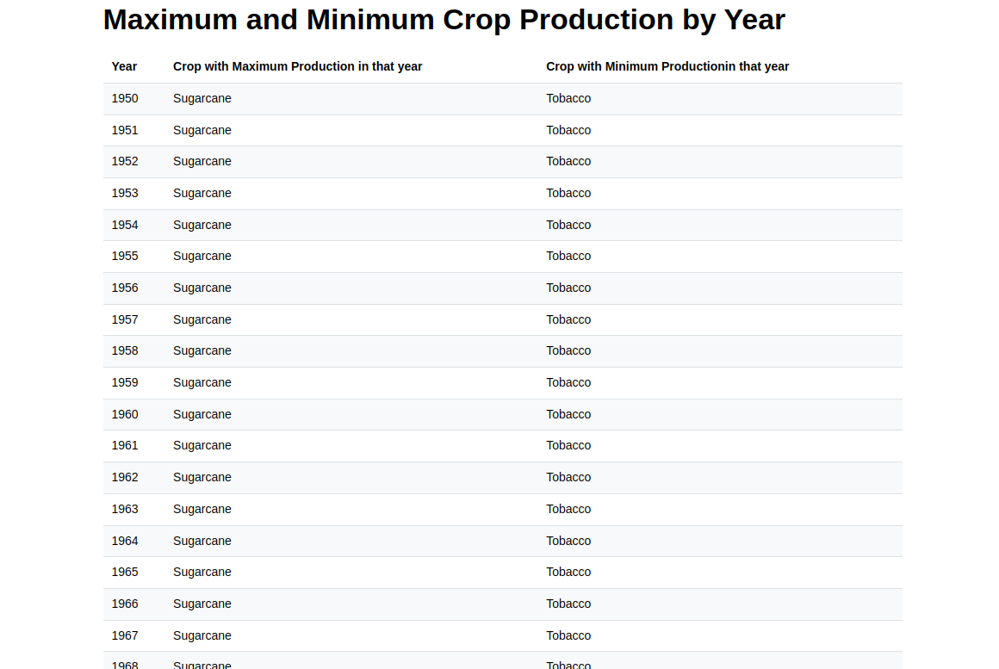
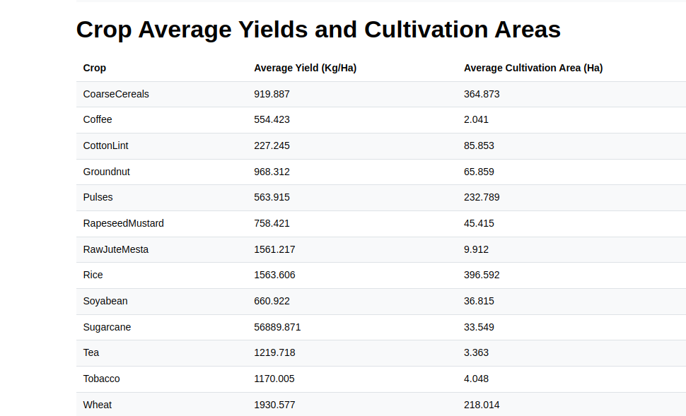

# Manufac Agriculture Data Analysis

## Project Overview
This project is a data analysis application for Indian agricultural data from 1950-2020, developed as part of the Manufac SDE Frontend Data Analysis Task. The application provides two key analytical tables:

1. **Maximum and Minimum Crop Production by Year**
2. **Crop Average Yields and Cultivation Areas**

## Technology Stack
- TypeScript
- React
- Vite
- Mantine v7

## Prerequisites
- Node.js (v18 or later)
- Yarn

## Installation Steps

1. Clone the repository
```bash
git clone https://github.com/yourusername/manufac-agriculture-analysis.git

```

2. Install dependencies
```bash
yarn install
```

3. Run the development server
```bash
yarn dev
```

4. Open in browser
The application will automatically open at `http://localhost:5173/`

## Project Structure
```
manufac-agriculture-analysis/
│
├── src/
│   ├── components/       # React components
│   ├── data/             # Agricultural dataset
│   ├── utils/            # Data processing utilities
│   ├── App.tsx           # Main application component
│   └── main.tsx          # Application entry point
│
├── README.md             # Project documentation
├── package.json          # Project dependencies and scripts
└── tsconfig.json         # TypeScript configuration
```

## Key Features
- Analyze crop production data from 1950 to 2020
- Display maximum and minimum crop production by year
- Calculate average crop yields and cultivation areas
- Responsive design using Mantine components

## Data Processing
The application processes agricultural data by:
- Handling missing or zero values
- Calculating year-wise and crop-wise statistics
- Rounding average values to 3 decimal places

## Screenshots

### Maximum and Minimum Crop Production Table


### Crop Averages Table


## Evaluation Criteria Compliance
- [x] Correct calculation of values
- [x] Efficient data processing
- [x] Clean, modular code structure
- [x] Comprehensive README
- [x] No additional helper libraries used


## Contact
For any queries, please contact the project maintainer @ rahulkrgupta18032003@gmail.com
```


